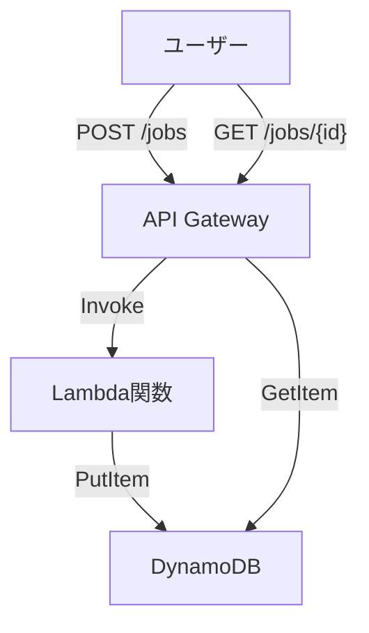

# Async Job API アーキテクチャ概要

> このプロジェクトは [asynchronous-event-processing-api-gateway-lambda-cdk](https://github.com/aws-samples/asynchronous-event-processing-api-gateway-lambda-cdk) を参考に、構成をシンプルにしたものです。  
> 学習・検証用途のため、最小限の機能に絞って実装しています。

## 概要

このシステムは、API Gateway・Lambda・DynamoDB を組み合わせて「非同期ジョブ登録」と「ジョブ結果取得」を提供します。  
API経由でジョブを登録すると、Lambda関数が非同期で処理を行い、結果をDynamoDBに保存します。  
ジョブの状態や結果はAPI経由で取得できます。

---

## アーキテクチャ図



---

## 構成要素

- **API Gateway**
  - `POST /jobs` : ジョブ登録（Lambdaを非同期実行）
  - `GET /jobs/{id}` : ジョブ結果取得（DynamoDBから直接取得）

- **Lambda関数（AsyncJobProcessor）**
  - 指定秒数スリープ後、ジョブ結果をDynamoDBに保存

- **DynamoDB（Jobsテーブル）**
  - ジョブIDごとに状態・結果・作成日時を保存

- **IAMロール**
  - Lambda用（DynamoDB書き込み権限）
  - API Gateway用（DynamoDB読み取り権限）

---

## API仕様

### 1. ジョブ登録

- **エンドポイント**: `POST /jobs`
- **リクエスト例**:

    ```json
    {
      "jobId": "任意のID（省略可）",
      "seconds": 3
    }
    ```

- **レスポンス**:  
  ステータスコード 202（非同期受付）

### 2. ジョブ結果取得

- **エンドポイント**: `GET /jobs/{id}`
- **レスポンス例（成功時）**:

    ```json
    {
      "jobId": "12345",
      "status": "Success",
      "results": {
        "message": "I slept for 3 seconds"
      },
      "createdAt": "2024-06-06T12:34:56.789Z"
    }
    ```

- **レスポンス例（未登録ID）**:

    ```json
    {
      "message": "Not found"
    }
    ```

---

## デプロイ後のエンドポイント

- `${ApiEndpoint}`  
  例: `https://xxxxxx.execute-api.{region}.amazonaws.com/prod`

---

## 補足

- ジョブの最大スリープ秒数は Lambda の環境変数 `TIMEOUT` で制御（デフォルト5秒）
- DynamoDB テーブル名は `Jobs`
- Lambda/ApiGateway の権限はIAMロールで厳密に制御

---

## デプロイ方法

AWS CLI または AWS CloudFormation で `template.yaml` をデプロイしてください。

```bash
# deploy
aws cloudformation deploy --template-file template.yaml --stack-name api-gateway-async-stack --capabilities CAPABILITY_NAMED_IAM


aws cloudformation describe-stacks \
  --stack-name "api-gateway-async-stack"

# clean up
aws cloudformation delete-stack \
  --stack-name "api-gateway-async-stack"
```
